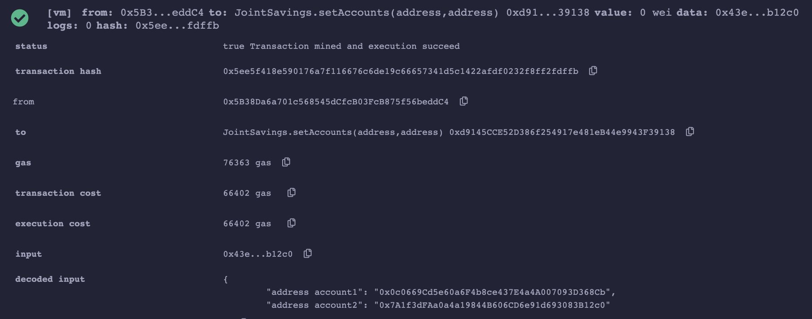
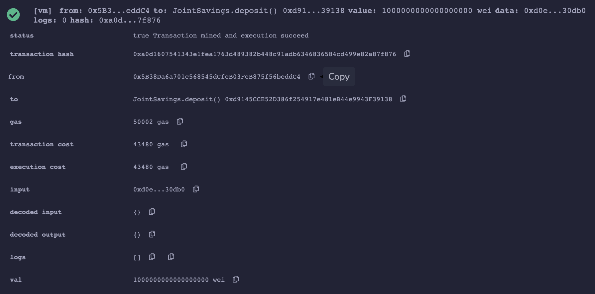
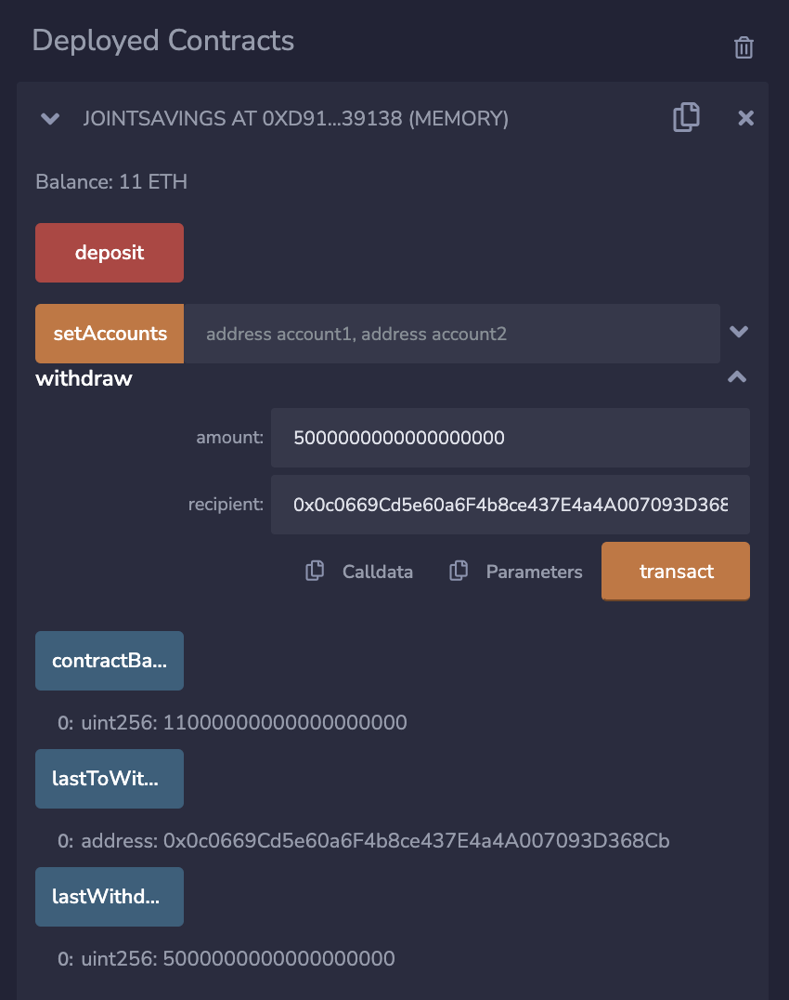

# Smart_Contracts_With_Solidity

The purpose of this project was to create a smart contract using Solidity to automate the creation of a joint savings account. The contract will only allow 2 user addresses access to the account, which includes the ability too check the balance, as well as deposit and withdraw funds. This was accomplished using the Remix IDE, which can be accessed at remix.ethereum.org. 

Once the smart contract was compiled and deployed on Remix, the first step was to use the setAccounts function to define who has access to the joint savings account. Our two test account addresses were:

Account 1 address: 0x0c0669Cd5e60a6F4b8ce437E4a4A007093D368Cb
Account 2 address: 0x7A1f3dFAa0a4a19844B606CD6e91d693083B12c0

The following image displays the confirmation of these adresses on Remix:

Next we made 3 deposits of ether into the savings account, 1 ether at first, then 10 ether, and a third deposit of 5 ether. 
The following images display the confirmation of these deposits, as well as the account balance following each deposit:

We then tested the withdrawal functionality of the smart contract by withdrawing 5 ether to accountOne and 10 ether to accountTwo. After each transaction we used the contractBalance function to view the updated account balance, as well as the lastToWithdraw and lastWithdrawAmount functions to see which user had made the withdawal and how much ether they withdrew. 

The following images display the confirmation of these withdrawals:

